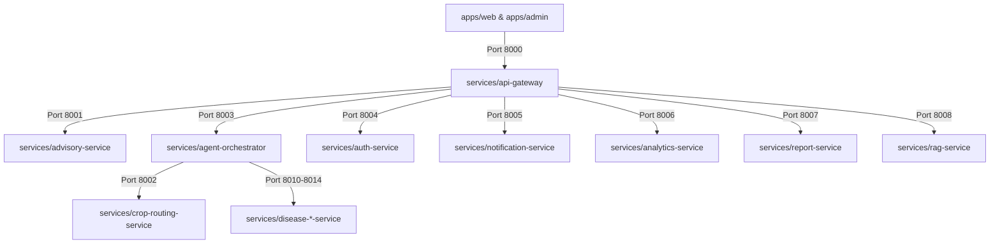

# AgriVision Platform Architectural Specification

This document maps out the system architecture, port allocations, data flow, and components of the AgriVision Platform.

---

## 🏗️ High-Level Topology

---

## 🔌 Unified Port Mapping

| Service Name | Port | Description |
|---|---|---|
| **`apps/web`** | `3000` | Public-facing Next.js Farmer Portal |
| **`apps/admin`** | `3001` | Next.js Command Center & GIS Portal |
| **`api-gateway`** | `8000` | Asynchronous Unified HTTP Gateway Proxy |
| **`advisory-service`** | `8001` | Conversational advisor & Gemini Interface |
| **`crop-routing-service`** | `8002` | Dynamic crop classifier & router |
| **`agent-orchestrator`** | `8003` | LangGraph agent node state coordinator |
| **`auth-service`** | `8004` | Supabase JWT & District Role Validator |
| **`notification-service`** | `8005` | Real-time SMS and Broadcast dispatcher |
| **`analytics-service`** | `8006` | Outbreak analytics and database queries |
| **`report-service`** | `8007` | High-fidelity PDF document generation |
| **`rag-service`** | `8008` | Qdrant Book Index query & embed interface |
| **`disease-rice-service`** | `8010` | YOLO model serving for Rice diseases |
| **`disease-brassica-service`** | `8011` | YOLO model serving for Brassica diseases |
| **`disease-corn-service`** | `8012` | YOLO model serving for Corn diseases |
| **`disease-potato-service`** | `8013` | YOLO model serving for Potato diseases |
| **`disease-wheat-service`** | `8014` | YOLO model serving for Wheat diseases |

---

## 📡 Core Data Flows

### 1. Diagnosis Pipeline
1. **Frontend Request**: The client uploads an image to `api-gateway` (`/diagnose`).
2. **Gateway Route**: The gateway proxies the request directly to `agent-orchestrator` on Port `8003`.
3. **Orchestrator Run**:
   * Nodes trigger `/predict` on `crop-routing-service` (Port `8002`) to classify the crop (e.g. "rice").
   * Next, nodes trigger `/predict` on `disease-rice-service` (Port `8010`) to identify diseases.
   * Finally, nodes load agronomic guidelines from `disease_details.json` and generate an expert diagnosis response.
4. **Response**: Dynamic JSON response containing labels, severity levels, and treatment suggestions is compiled and sent back.
