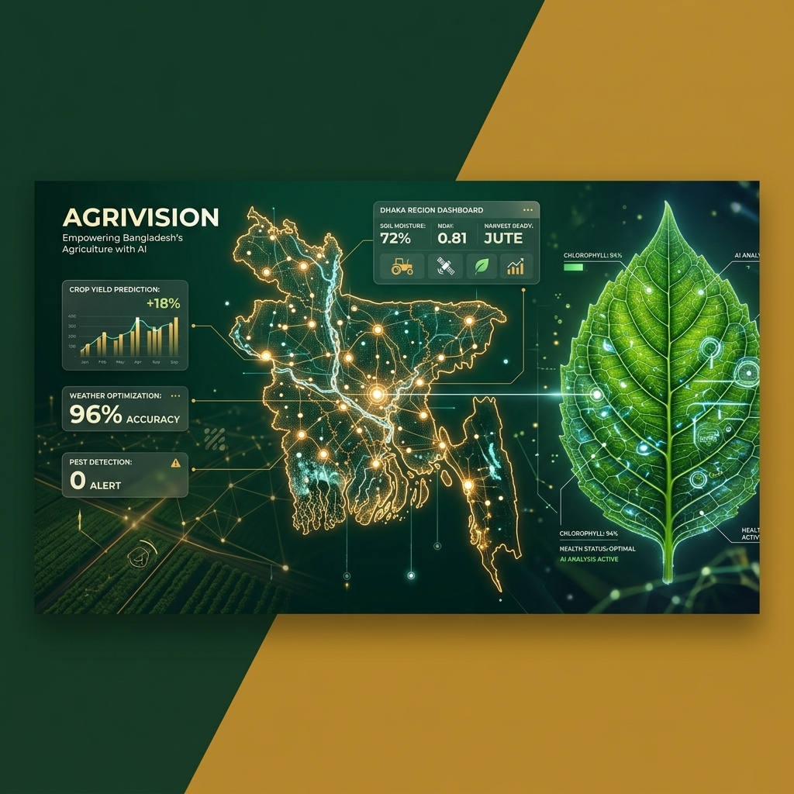
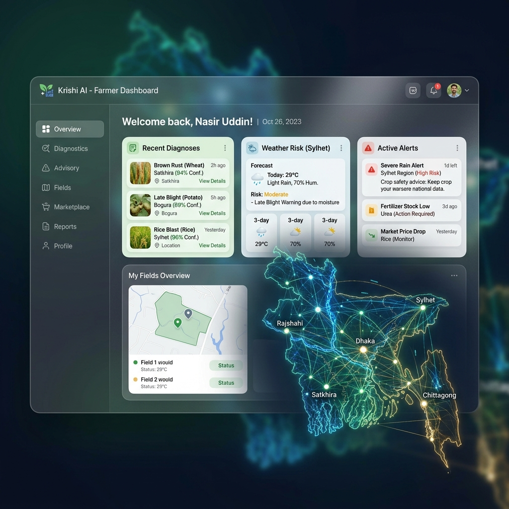
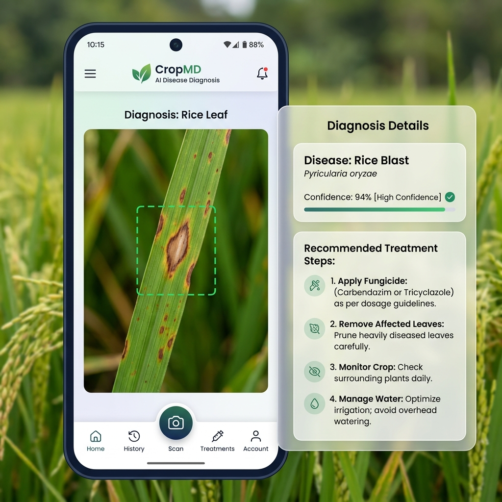
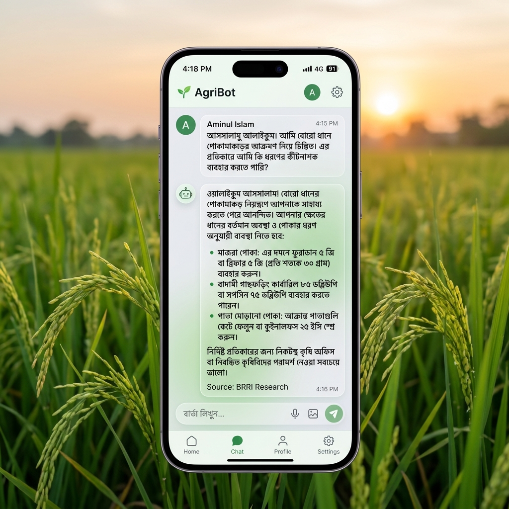
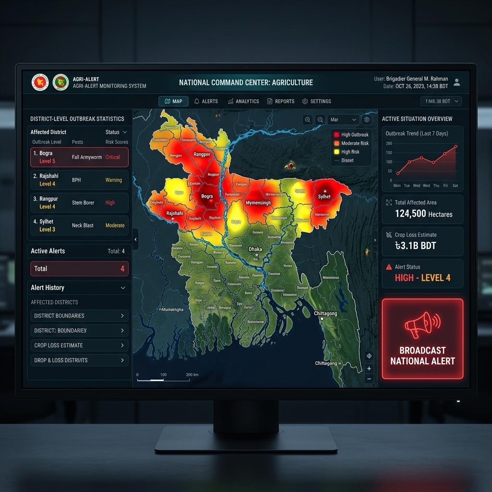
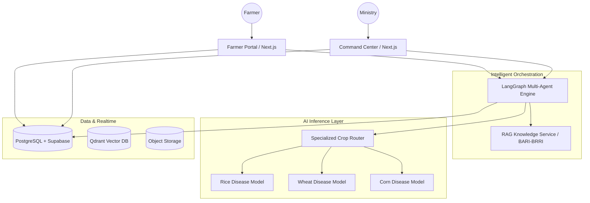

<p align="center">
  
</p>

<h1 align="center">🌾 AgriVision AI</h1>

<p align="center">
  <strong>The Future of Bangladeshi Agriculture — Powered by Multi-Agent Intelligence</strong>
</p>

<p align="center">
  
  
  
  
  
  
</p>

---

## 📖 Project Vision

**AgriVision AI** is a government-scale, AI-native agricultural operating system designed to empower the heart of Bangladesh — its farmers. By bridging the gap between rural fields and national expertise, we provide an ecosystem that transforms how diseases are diagnosed, how advisory is delivered, and how national agricultural outbreaks are managed.

> [!IMPORTANT]
> **Architected for Scale**: This platform is built on a modular micro-frontend and micro-service architecture, allowing for independent evolution of AI models, geospatial tools, and farmer interfaces.

---

## 🚜 Core Functionalities

### 1. High-Fidelity Farmer Dashboard
The Farmer Portal is designed with a **Premium Glassmorphic UI**, balancing technical density with rural accessibility. 
*   **Animated Semantic Map**: A live, glowing background map of Bangladesh that provides contextual regional awareness.
*   **Health Tracking**: Monitor farm health trends, historical diagnoses, and active alerts in a unified view.

<p align="center">
  
</p>

### 2. AI-Powered Disease Diagnosis
Leveraging specialized computer vision models, AgriVision provides instant, high-accuracy diagnosis for critical Bangladeshi crops.
*   **Domain Routing**: Automatically routes images to specialized models (Rice, Wheat, Corn, etc.).
*   **Detailed Analytics**: Receive confidence scores, severity estimates, and immediate treatment protocols.

<p align="center">
  
</p>

### 3. AgriBot: LangGraph Multi-Agent Advisor
AgriBot is not just a chatbot; it is a sophisticated orchestration of multiple agents that provide context-aware, research-grounded advice.
*   **Contextual Memory**: Remembers your previous questions and farm history.
*   **RAG Integration**: Grounds all advice in official BARI/BRRI research documents for maximum trust.

<p align="center">
  
</p>

### 4. National Command Center (GIS)
The administrative "War Room" for the Ministry of Agriculture to monitor and respond to national outbreaks.
*   **Live Hotspot Mapping**: Real-time interactive GIS map showing disease hotspots with pulse animations.
*   **Emergency Broadcast**: One-click national alerts to thousands of farmers in high-risk regions.

<p align="center">
  
</p>

---

## 🏗️ System Architecture

AgriVision follows a **Contract-First, Modular Monorepo** design to ensure long-term maintainability and easy feature integration.



---

## 🛠️ Technical Stack Specifications

*   **Frontend**: [Next.js 16 (App Router)](https://nextjs.org), [React 19](https://react.dev), [Framer Motion](https://www.framer.com/motion/)
*   **Backend**: [FastAPI (Python 3.12)](https://fastapi.tiangolo.com), [Pydantic v2](https://docs.pydantic.dev/)
*   **AI/Agents**: [Google Gemini 1.5 Flash](https://ai.google.dev), [LangGraph](https://www.langchain.com/langgraph), [LangChain](https://langchain.com)
*   **Data Layer**: [Supabase](https://supabase.com), [PostgreSQL](https://postgresql.org), [Qdrant](https://qdrant.tech)
*   **Styling**: [Tailwind CSS 4](https://tailwindcss.com), [Shadcn UI](https://ui.shadcn.com)

---

## 🚀 Future Expansion & Upcoming Features

AgriVision is designed to evolve into a full-scale **National Agricultural Digital Twin**. Our future roadmap includes:

- 🛰️ **Satellite Field Health (NDVI)**: Integrating Sentinel-2 data to monitor biomass, water stress, and crop growth across entire districts.
- 🗣️ **Bengali Voice Interaction (NLP)**: Real-time speech-to-text advisory for farmers, supporting regional dialects and low-literacy accessibility.
- 💰 **Marketplace Price Tracker**: Dynamic regional crop pricing and demand forecasting to help farmers maximize their profit margins.
- 🌡️ **IoT Edge Integration**: Direct connectivity with soil moisture, pH, and nutrient sensors for precision fertilizer and irrigation guidance.
- 📉 **Predictive Outbreak Modeling**: AI-driven forecasting that predicts pest and disease spread 14 days in advance based on weather and historical GIS data.

---

## 📅 Roadmap: The Path Forward

| Phase | Milestone | Focus | Status |
| :--- | :--- | :--- | :---: |
| **Phase 1** | **Foundation** | Core UI, Auth, and Basic Diagnosis | ✅ Done |
| **Phase 2** | **Intelligence** | Multi-Agent Orchestration & RAG | ✅ Done |
| **Phase 3** | **Command** | GIS Heatmaps & National Alert System | ✅ Done |
| **Phase 4** | **Stability** | Unified Design System & Asset Integration | ✅ Done |
| **Phase 5** | **National Scale** | Satellite NDVI, Voice NLP, and Marketplace | ⏳ Planned |

---

## 🚀 Getting Started

### 1. Prerequisites
- Node.js v20+
- Python 3.12+
- pnpm v9+

### 2. Installation
```bash
# Clone the repository
git clone https://github.com/RaiyaanReza/I-Powered-Smart-Agriculture-Advisory-Platform-for-Bangladesh.git

# Install dependencies
pnpm install
```

### 3. Execution
```bash
# Start all apps and services simultaneously
pnpm dev

# Or start specific applications
pnpm dev --filter web   # Farmer Portal (:3000)
pnpm dev --filter admin # Admin Center (:3001)
```

---

## 📂 Documentation

*   📑 **[Project Overview](docs/01_PROJECT_OVERVIEW.md)**: Product vision and philosophy.
*   🏗️ **[System Architecture](docs/02_SYSTEM_ARCHITECTURE.md)**: Technical deep dive.
*   🎨 **[Design Architecture](docs/03_DESIGN_ARCHITECTURE.md)**: UI/UX strategy.
*   📜 **[Current State](CURRENT_STATE.md)**: Latest progress and sprint tracking.

---

<p align="center">
  Made with ❤️ for the Farmers of Bangladesh.
</p>
